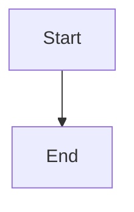

# About

This microsite serves dual purposes, combining academic coursework with professional writing portfolio work.

## Purpose

### School Assignment: Docusaurus Microsite Development

This microsite was created as part of **Assignment 3: Working with Docusaurus**, which required:

- Setting up and customizing a Docusaurus framework
- Creating personalized content and design elements
- Implementing custom styling and navigation
- Deploying the site to GitHub Pages

The project demonstrates proficiency in:
- Docusaurus framework configuration
- React component customization
- CSS styling and theming
- GitHub Pages deployment
- Version control with Git

### Mermaid Diagram Integration

Mermaid diagrams are integrated into this site to visualize workflows and processes. The installation and configuration process involved:

**Installation:**
```bash
npm install @docusaurus/theme-mermaid
```

**Configuration:**
The Mermaid theme was added to `docusaurus.config.js`:
```javascript
themes: ['@docusaurus/theme-mermaid'],
```

**Usage:**
Mermaid diagrams can be embedded in markdown files using code blocks with the `mermaid` language identifier:
````markdown

````

This integration enables the creation of flowcharts, sequence diagrams, and other visual documentation directly within markdown content.

### Skio Writing Assignment Submission

This microsite also serves as the submission platform for a **technical writing assignment for Skio**, featuring:

- **Part A: Product Release Documentation Plan** for Shopify POS Integration for Subscriptions
- Comprehensive documentation strategy covering both external Help Center content and internal Knowledge Base materials
- Content prioritization and cross-linking strategies
- Audience-specific documentation approaches

The writing assignment demonstrates:
- Technical writing skills
- Documentation planning and strategy
- Understanding of help center best practices
- Content organization and information architecture

## Background

This project combines technical skills development with real-world application, using Docusaurus to showcase both web development capabilities and technical writing expertise. The site serves as both a portfolio piece and a practical demonstration of creating documentation for a SaaS product.
